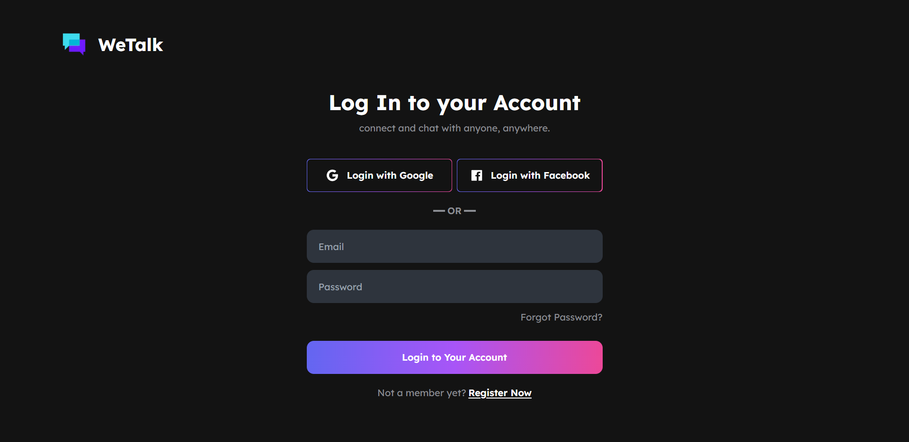
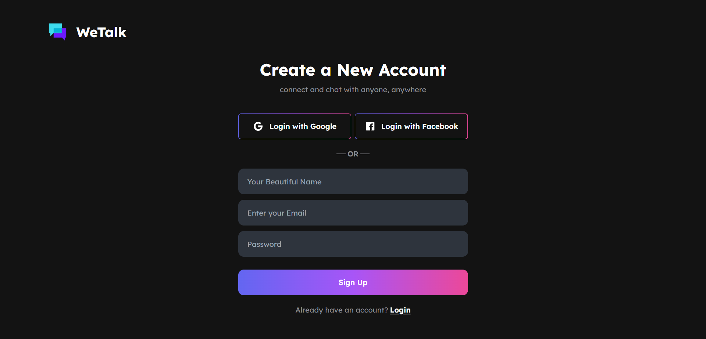
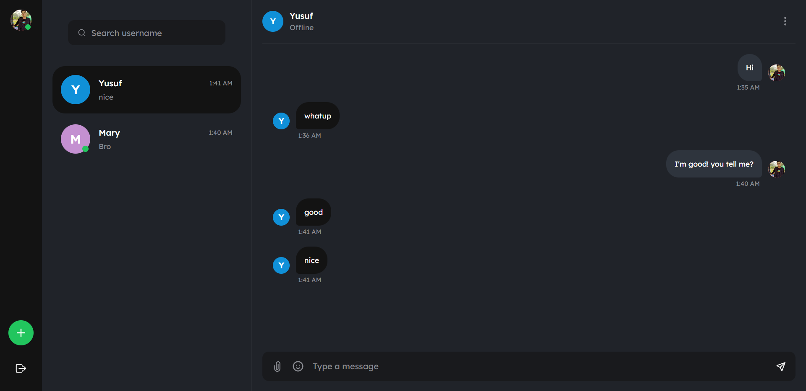
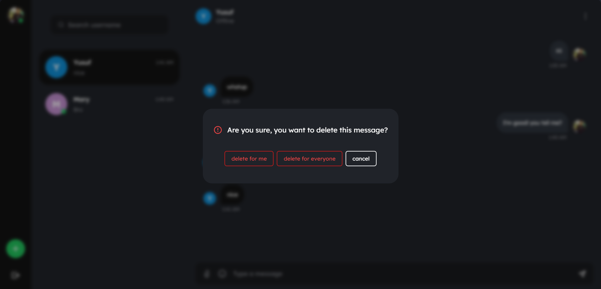

<div align="center">

# WeTalk

**A realtime chat app for the web — voice notes, reactions, replies, and presence.**

[](https://nextjs.org/)
[](https://react.dev/)
[](https://tailwindcss.com/)
[](https://firebase.google.com/)
[](LICENSE)

### [→ Try the live demo](https://we-talk-nextjs.vercel.app)

</div>

---

## Try it in 10 seconds

Open the [live demo](https://we-talk-nextjs.vercel.app) and hit **"Sign in as Guest"**. No signup, no email, no password — you land straight in a real conversation with working voice notes and reactions.

---

## Features

**Messaging**
- Realtime one-to-one chat, powered by Firestore snapshot listeners
- **Voice notes** — record in-browser, waveform playback, optimistic send with tap-to-retry if the upload fails
- Image sharing with a full-screen viewer
- Emoji reactions on any message
- Replies with quoted context
- Edit sent messages, and delete either *for me* or *for everyone*

**Accounts & people**
- Sign in with Google, Facebook, email + password, or as a **guest**
- Online / offline presence indicators
- Unread message counts per conversation
- User search, and the ability to block someone

**Personalisation**
- Editable display name and avatar
- 16 profile colour themes
- Dark UI throughout, with distinct mobile and desktop layouts

---

## Screenshots

| Login | Register |
|:---:|:---:|
|  |  |

| Chat | Delete a message |
|:---:|:---:|
|  |  |

> **Screenshots are being refreshed.** The captures above predate several features and don't yet show voice notes, reactions, replies, the guest sign-in button, or any mobile layout. Two older screenshots were removed because they exposed user email addresses.
>
> **To capture:** mobile chat view · a voice note mid-playback · a message with reactions · a reply with quoted context · the profile colour picker.

---

## Tech stack

| Layer | Choice |
|---|---|
| Framework | Next.js 13.4 (Pages Router) |
| UI | React 18.2, Tailwind CSS 3.3 |
| Animation | Framer Motion |
| Auth | Firebase Authentication |
| Database | Cloud Firestore (realtime listeners) |
| Media storage | Cloudinary (images + voice notes) |
| Hosting | Vercel |

---

## How it works

Firebase Authentication handles sign-in across all four providers. Each user gets a profile document in the `users` collection, which also carries their presence flag and colour theme.

Conversations live in `chats/{chatId}`, where `chatId` is derived deterministically from the two participants' UIDs — so both sides resolve to the same document without a lookup. The client subscribes with `onSnapshot`, so messages, reactions, and edits propagate live with no polling.

Images and voice recordings upload straight to Cloudinary from the browser; only the resulting URL is stored on the message. A small Next.js API route at `/api/audio-proxy` streams voice notes through the server behind a host allowlist, which keeps playback consistent across browsers.

---

## Running locally

You'll need Node 18+, a Firebase project, and a Cloudinary account.

**1. Install**

```bash
git clone https://github.com/hahahamid/WeTalk-nextJS-chatapp.git
cd WeTalk-nextJS-chatapp
npm install
```

**2. Set up Firebase**

Create a project in the [Firebase console](https://console.firebase.google.com/), then:

- Under **Authentication → Sign-in method**, enable *Google*, *Facebook*, and *Email/Password*
- Under **Firestore Database**, create a database and publish security rules that restrict reads and writes to the participants of each chat
- Copy your web app config into `firebase/firebase.js`, replacing the existing `firebaseConfig` object

**3. Set up Cloudinary**

Create an [unsigned upload preset](https://cloudinary.com/documentation/upload_presets), then update the two constants at the top of `utils/helper.js`:

```js
const CLOUDINARY_CLOUD  = "your-cloud-name";
const CLOUDINARY_PRESET = "your-unsigned-preset";
```

**4. Run**

```bash
npm run dev
```

Open [http://localhost:3000](http://localhost:3000).

> **Note:** configuration is currently committed in source rather than read from environment variables — see below.

---

## What I'd do differently

This was built in 2023, and a few decisions haven't aged well:

- **Messages are stored as an array inside a single chat document.** Firestore caps documents at 1 MiB, and every edit or reaction rewrites the whole array — which also makes concurrent writes race. A `chats/{chatId}/messages/{messageId}` subcollection solves all three at once, and it's the change I'd make first.
- **Config lives in source, not environment variables.** The Firebase and Cloudinary settings should come from `.env.local` so forks aren't wired to my project by default.
- **No TypeScript and no tests.** For an app this size, types would have caught real bugs, and the message-rendering and scroll logic in particular deserve coverage.
- **User-document creation is duplicated three times** — in `login.js`, `register.js`, and `authContext.js` — and the copies have drifted apart. That belongs in one function called from one place.

---

## License

[MIT](LICENSE) © Miran Hamid
